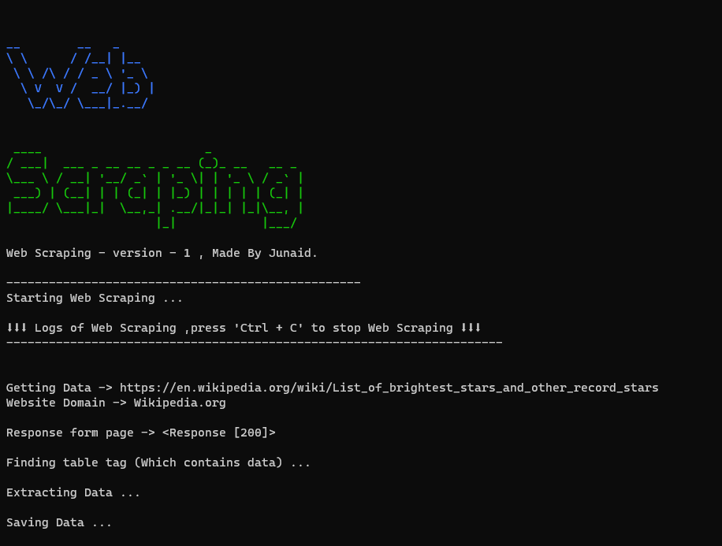

# Web Scraping 1

Web Scraping 1 , This will scrape web and get the result what you need , In simples works it will hack that website or webpage and get the results what you need. Here I hacked Wikipedia to get the table which contains data. ! This is for learning purpose only - don't copy paste any data on website to your website. Made By [Junaid](https://abujuni.dev).

- Data (as webpage)-> https://en.wikipedia.org/wiki/List_of_brightest_stars_and_other_record_stars
  
  This table contains `<table>` ,`<tr>` and `<tl>` tags , which this Web Scraping finds and copy that text and using the help of for loop it take into one array and uses python data science tool `pandas` and web page testing tool `bs4`.

- Output -> this shows all logs and step to step information to ensure that , our browser don't go into bad hands , who can see your all personal information.
  

- Result -> It saves your result as `bright_stars.csv` , and you can see your data here .
  

---

## Installation

- Clone this repo
- Use this command -> `pip install -r requirements.txt`
- Run by typing -> `Python app.py`

Boom ! , You get this interface.

Boom ! , Then

- It asks `You want to see Web Scrapped data (y / n)` , say yes as `y` .
  

---

**Made By [Junaid](https://abujuni.dev) .**
